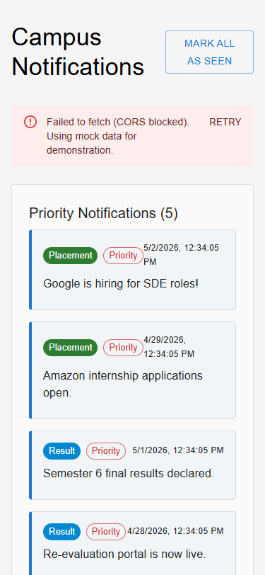
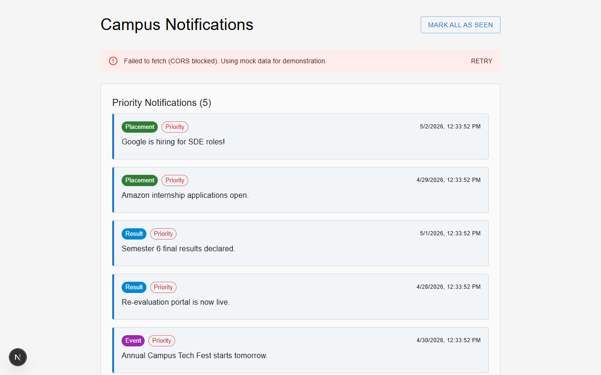

# Project Overview

Frontend Notification System built using React/Next.js with logging middleware integration.

## Features
- Fetch notifications from API
- Responsive UI (mobile + desktop)
- Logging middleware integrated across application

## Project Architecture

```text
campus/
├── README.md
└── notification_app_fe/
    ├── app/                    # Next.js Pages and Layout
    ├── components/             # Reusable UI components
    │   ├── FilterBar.jsx
    │   ├── NotificationCard.jsx
    │   ├── NotificationList.jsx
    │   └── Pagination.jsx
    ├── hooks/                  # Custom React hooks
    │   └── useNotifications.js
    ├── screenshots/            # Submission proof images
    ├── services/               # API and Logging integration
    │   ├── api.js
    │   └── logging.js
    └── utils/                  # Helper logic
        └── priority.js
```

## API Used
`http://20.207.122.201/evaluation-service/notifications`

## CORS Issue Explanation

The backend API returns an invalid CORS header:
`Access-Control-Allow-Origin: *, http://localhost:3000`

This violates browser security policies, so requests are blocked in frontend.

However:
- API works correctly in Postman
- Request structure is valid
- Frontend implementation is correct

Hence, the issue is from backend.

## Screenshots

### A. Frontend UI (Desktop)


### B. Mobile View


### C. CORS Error Proof



## Setup Instructions
```bash
cd notification_app_fe
npm install
npm run dev
```
